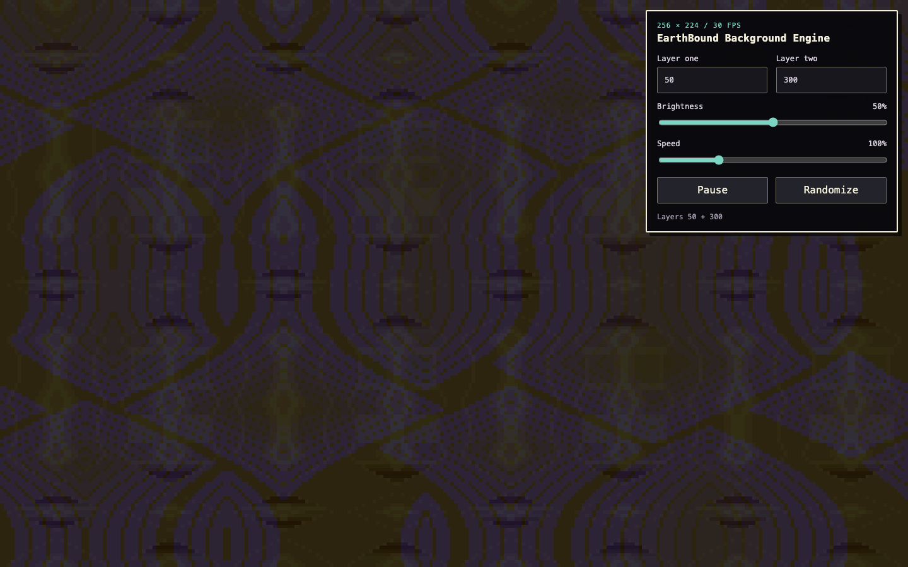

# EarthBound Background Engine

Turn a Raspberry Pi into a standalone EarthBound battle-background player. It
reconstructs the original SNES tiles, palettes, palette cycles, and distortion
effects for all 327 background layers, then sends the finished 256×224 image to
a fullscreen browser.

This renderer started in
[ghostty-earthbound-shader](https://github.com/kevindjacobson/ghostty-earthbound-shader).
It lives here so the same frame code can be used without a terminal emulator.

The server has no runtime dependencies. A display and a second browser can opt
into the same synchronized room with a shared URL code.



## Run locally

Node 20 or newer is required.

```sh
npm start
```

Open <http://127.0.0.1:8787/> for the player. Each ordinary page load starts
with a random pair of distinct layers and keeps state in that browser tab. Add
the same non-empty `?code=...` value to two URLs to synchronize them through
the server.

Keyboard controls:

- `↑ ↑ ↓ ↓ ← → ← → B A`: reveal the controls
- `C`: collapse or expand revealed controls
- `R`: randomize the pair
- `Space`: play or pause

Use **Tap tempo** two or more times to match the animation speed to a beat.
At the native 30 fps cadence, 120 BPM maps to 100% speed, or 15 frames per
beat. A pause longer than two seconds starts a new tempo reading.

The player uses WebGL 2 to decode the native SNES tile, arrangement, and
palette textures. Choose **Enable mic** to let nearby music drive integer
scanline displacement, palette-index cycling, and restrained RGB separation.
The logical image remains 256×224 at 30 fps, texture colors stay within each
layer's original BGR555 palette, and scaling remains nearest-neighbor. If WebGL
2 is unavailable, the exact CPU renderer remains available without audio
reactivity.

The server listens on localhost by default. To control it from a phone or
another computer on your LAN, listen on all interfaces:

```sh
EARTHBOUND_BIND_HOST=0.0.0.0 npm start
```

There is no authentication. Keep it on a trusted LAN; do not forward port 8787
from your router.

## Online player

The public player is available at <https://justalilguy.com/> and
<https://www.justalilguy.com/>. The legacy <https://earf.justalilguy.com/>
address remains available. Its default mode is local to the browser: it does
not open the state API, connect to the event stream, or resolve a Durable
Object. All player responses carry a `noindex` policy and the HTML repeats it
as a robots directive.

To create a synchronized, durable room, add a non-empty code to the URL, such
as `https://earf.justalilguy.com/?code=my-private-room`. Anyone who knows that
URL can join and control the room, so use a long, unguessable code when the
state should be private.

## Raspberry Pi

The included installer sets up two user-level files:

- a `systemd` service for the Node server
- an XDG autostart entry that opens Chromium in kiosk mode

On Raspberry Pi OS Desktop, clone the repository and run:

```sh
./scripts/install-raspi.sh
```

The installer does not use `sudo` or change any system settings. Use
`raspi-config` separately to enable desktop autologin and disable screen
blanking. The service remains bound to localhost unless you edit its generated
unit file.

After installing, reboot into the graphical desktop. To inspect the server:

```sh
systemctl --user status earthbound-background-engine.service
journalctl --user-unit earthbound-background-engine.service
```

The Pi setup has not been tested on physical hardware yet.

## API

On Cloudflare, all state API routes require the same non-empty `code` query
parameter used by the player URL. `GET /healthz` remains code-free and does not
resolve a Durable Object.

- `GET /healthz`
- `GET /api/state`
- `PUT /api/state` with a JSON partial state
- `POST /api/randomize` with `Content-Type: application/json`
- `GET /api/events` for server-sent state events

Layer IDs range from `0` to `326`. Brightness accepts `0` to `100`, and speed
accepts `0` to `400` percent.

## Rendering

`data/native-data.json` contains 103 graphics banks and their 32×32 tile maps.
`data/layers.json` supplies the palettes, layer mappings, palette-cycle rules,
and distortion settings. The renderer produces native 256×224 RGBA frames at
the original 30 fps tick rate. The browser scales them with nearest-neighbor
sampling and crops to fill the screen.

Frames used in the tests are checked against hashes from the upstream renderer.

## Verify

```sh
npm test
npm run check
```

`npm run check` verifies the data hashes, JavaScript syntax, shell syntax, and
test suite.

## Provenance and license

The renderer and extracted data come from the pinned upstream revision recorded
in [THIRD_PARTY_NOTICES.md](./THIRD_PARTY_NOTICES.md).

This package's own code is MIT licensed. EarthBound and related names belong to
their respective owners; this is an independent fan project.
